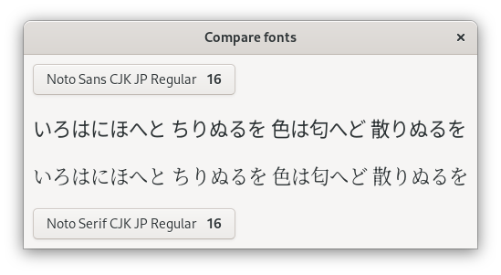

# compare-fonts

## Usage

```shellsession
$ compare-fonts --lang ja --no-wrap --margin 15
```



Uses Haskell
[gi-gtk-declarative](https://hackage.haskell.org/package/gi-gtk-declarative).

## Installation

On Fedora install `ghc-gi-gtk-devel` and then run `cabal install`

Can also build with `stack install` if your Harfbuzz not too new.
